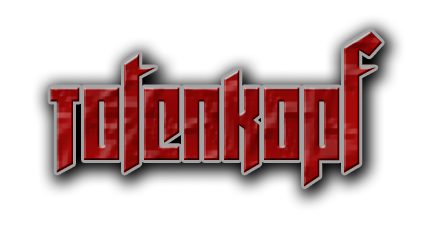

A Hardmode Mod for **Return To Castle Wolfenstein** that tweaks enemy parameters and weapons to increase difficulty.
> ⚠️ **Work in progress**

---

# Change Notes

**`escape1`** - *`Enemy Health set to 100, Flamethrower added and made more aggressive`*

**`escape2`** - *`Enemy Health set to 100, Venom added and made more aggressive`*

**`tram`** - *`Enemy Health set to 100 and made more aggressive`*

**`village1`** - *`Enemy Health set to 100, Flamethrower added and made more aggressive`*

**`crypt1`** - *`Enemy / Zombie Health set to 100 and made more aggressive`*

**`crypt2`** - *`Enemy / Zombie Health set to 100 and made more aggressive`*

**`church`** - *`Enemy Health set to 100 and made more aggressive`*

**`boss1`** - *`Boss / Zombie Health increased`*

**`forest`** - *`Enemy Health set to 100`*

**`rocket`** - *`Enemy Health set to 100 and made more aggressive`*

**`baseout`** - *`Enemy Health / Accuracy set to 100 and made more aggressive`*

**`assault`** - *`Enemy Health / Accuracy set to 100 and made more aggressive`*

**`sfm`** - *`TBD`*

**`factory`** - *`TBD`*

**`trainyard`** - *`TBD`*

**`swf`** - *`TBD`*

**`norway`** - *`TBD`*

**`xlabs`** - *`TBD`*

**`boss2`** - *`TBD`*

**`dam`** - *`Enemy Health / Accuracy set to 100 and made more aggressive`*

**`village2`** - *`TBD`*

**`chateau`** - *`TBD`*

**`dark`** - *`TBD`*

**`dig`** - *`TBD`*

**`castle`** - *`TBD`*

**`end`** - *`TBD`*

---

# Requirements

- **[iortcw](https://github.com/iortcw/iortcw)** — required to run this mod.
- **Making a backup of your original RTCW installation is strongly recommended.**

---

# Installation

Put **`_totenkopf.pk3`** into your **`RTCW/Main`** directory. Optionally you can copy **`autoexec.cfg`** to **`RTCW/Main`**.

### autoexec.cfg

```
set devdll 1
com_introplayed 1
```

---

# Console Commands

**[Console commands](utils/public/docs/CMDLIST.MD)**

---

# Cvars

***CVars** (Console Variables) are configurable settings built into the Quake III engine that RTCW runs on. They control everything from graphics and sound to gameplay and network behaviour, and can be changed at runtime by typing them directly into the game console. Most are saved to your config file and persist between sessions.*

You can generate a list in the console by typing `/cvarlist`.

You are then able to type `/condump cvar.txt` into the console and this will then save to your `Documents/RTCW/main` directory.

**[CVar Reference](utils/public/docs/CVARS.md)**

---

# Map Info

**[Google Sheet](https://docs.google.com/spreadsheets/d/1WNbb9BuFqzYIRbGS05KWTZ2ceKHzF7NfaJCFXsRv0qo/edit?usp=sharing)**

---

# Utils

Within the *`utils/public/bat`* folder you will find **`bsp2map.bat`**. This simple batch file will allow you to convert the original map .bsp files located within **`RTCW/Main/pak0.pk3`** back into editable .map files. 

```
@echo off
set "Q3MAP2=path\to\q3map2.exe"
set "INPUTDIR=path\to\input\directory"
set "OUTPUTDIR=path\to\output\directory"

if not exist "%OUTPUTDIR%" mkdir "%OUTPUTDIR%"

for %%f in ("%INPUTDIR%\*.bsp") do (
    echo Converting %%~nxf...
    "%Q3MAP2%" -game wolf -convert -format map -v "%%f"
    move "%%~dpnf.map" "%OUTPUTDIR%"
)

echo Done!
pause
```
Open **`bsp2map.bat`** in a text editor and put your path's within:

-`set "Q3MAP2="`

-`set "INPUTDIR="`

-`set "OUTPUTDIR="`

Save and then run the file. 

**The process may take some time and some textures/shaders may not convert correctly**

---

# What are .ai scripts?

Put simply .ai scripts tell your player / actors what to do they store such information like weapon and ammo type, their animation calls amongst other things, a small example can be seen here taken from boss1.ai.

```
helga_zombie	// reincarnation of helga
{
	attributes
	{
		pain_threshold_scale 50
		starting_health 1000
		aggression 1.0
		fov 360
	}

	spawn
	{
		accum 0 set 0 // 1 = helga has broken gate
		accum 1 set 0 // 1 = fired fakedeath
		accum 2 set 0 // 1 = gate blown
		statetype alert
		knockback off
		godmode on
		nosight 999999
		wait 100
		runtomarker helga1 nostop
		runtomarker helga2 nostop
		alertentity closedoor
		runtomarker helga3 nostop
		runtomarker helga4 nostop
		runtomarker helga5 nostop
		godmode off
		runtomarker helga6
		alertentity blowfence
		accum 2 set 1 // 1 = gate blown
		playanim attack3 both
		trigger player phitcorner1	// simulate hitting a corner to force some zombie out of their coffins
		runtomarker helga7
		attrib pain_threshold_scale 10
		sight
		accum 0 set 1
		gotocast player
	}

    .
    .
    .

```

This mod alters certain parts of these .ai script files to make the game more challenging for experienced players. 

---

# What are .script files?

The .script files from baseout.script, assault.script for example are brush/entity scripts that drive dynamic map behaviour at runtime. 

They control AI triggers and enemy wave spawning, scripted entity animations (the rotating radar dish and its destruction sequence), objective state tracking (e.g. whether the radar has been destroyed), timed event chains, and conditional logic based on in-game conditions. 

These files are loaded automatically by the engine alongside the compiled .bsp and require no additional setup.

An example of .script files can be seen here.

```
dialog // dialog counter
{
	spawn
	{
		accum 0 bitset 0
		accum 0 bitset 1
		accum 0 bitset 2
		accum 0 bitset 3
	}

	trigger timeing
	{
		accum 0 abort_if_not_bitset 0
		wait 1200
		trigger nazi1 door1
		wait 7500
		trigger nazi1 answer1
		wait 6000
		trigger nazi1 answer2
	}

	trigger killdialog1
	{
		accum 0 abort_if_not_bitset 0
		accum 0 bitreset 0
		accum 0 bitreset 1
		resetscript
	}

	trigger radiotune
	{
		accum 0 abort_if_not_bitset 1
		trigger nazi2 reply1a
		trigger nazi3 talk3
		wait 3000
		trigger nazi3 weather
		wait 6100
		trigger nazi3 thanks
	}

	trigger killdialog2
	{
		accum 0 abort_if_not_bitset 1
		accum 0 bitreset 0
		accum 0 bitreset 1
		resetscript
	}

	trigger anynews
	{
		accum 0 abort_if_not_bitset 2
		wait 900
		trigger nazi5 reply5a
		wait 1800
		trigger nazi2 reply2a
		wait 3700
		trigger nazi5 reply5b
		wait 3500
//		trigger nazi2 reply2b
		wait 3000
		trigger nazi5 reply5c
		wait 2800
		trigger nazi2 reply2c
	}

	trigger killdialog3
	{
		accum 0 abort_if_not_bitset 2
		accum 0 bitreset 2
		resetscript
	}

	trigger radiotalk
	{
		accum 0 abort_if_not_bitset 3
		trigger nazi12 radio12a
		wait 2800
		trigger nazi13 radio13a
		wait 2250
		trigger nazi12 radio12b
		wait 4500
		trigger nazi13 radio13b
		wait 2700
		trigger nazi12 radio12c
		wait 2700
		trigger nazi13 radio13c
		wait 3600
		trigger nazi12 radio12d
		wait 3800
		trigger nazi12 towindow
		wait 200
		trigger nazi13 toradio
	}

	trigger killdialog4
	{
		accum 0 abort_if_not_bitset 3
		accum 0 bitreset 3
		resetscript
	}

}

.
.
.

```

---

